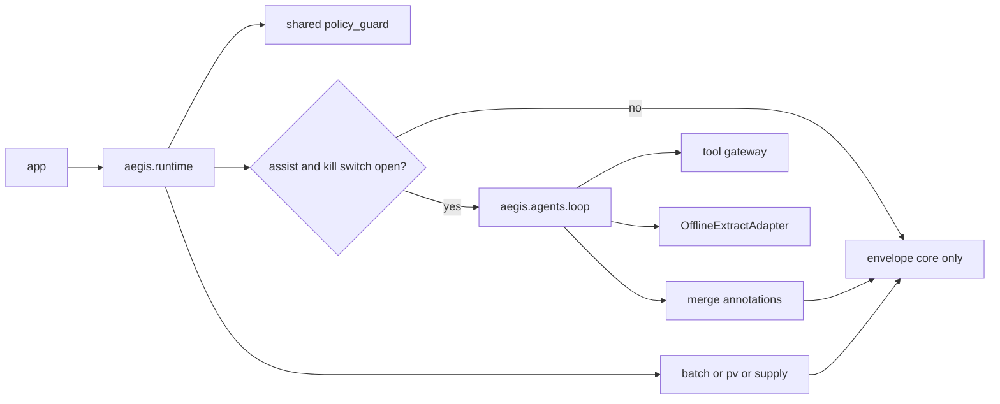

# Architecture — Agentic Assist Placement

**Question this file answers:** Where does the code belong?

| Field | Entry |
|---|---|
| Version / date | 1.0 / 2026-08-12 |
| Style | Modular monolith (single deployable) |
| ADRs | ADR-013 modular packages; ADR-014 assist envelope |

## Package map

```
submission/src/aegis/
  shared/       # contracts, policy_guard, gates, finops, model_gateway, tool_registry
  batch/        # deterministic reconcile_batch
  pv/           # deterministic build_pv_response
  supply/       # deterministic build_supply_response
  agents/       # assist-only loop, merge, tools, OfflineExtractAdapter
  runtime/      # composition root: deterministic first, agent optional
submission/app/ # demo.py, taipy_app.py — thin UI only
submission/specs/
```

## Dependency rule

| From | May import | Must not import |
|---|---|---|
| `batch` / `pv` / `supply` | `shared` | each other, `agents`, `app` |
| `agents` | `shared` | workflow package internals, `app` |
| `runtime` | workflows + `agents` + `shared` | `app` |
| `app` | `runtime` (preferred) or public package exports | — |
| `shared` | stdlib / local shared only | workflows, `agents` |

## Runtime sequence



## Boundaries

- Inference adapter is replaceable; kill switch isolates it only.
- No write container to LIMS/MES/QMS/safety/IRT.
- Prompts are source under `submission/specs/prompts/`.

## UI placement

- CLI/Taipy call `runtime.run(...)`.
- UI must not implement OTP-equivalent business rules (here: must not implement policy/tool checks).
