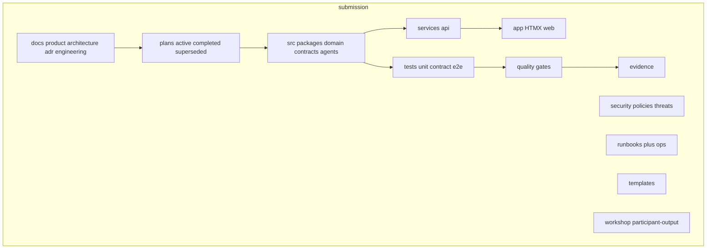

# Modular Agentic App Plan

> Working plan for Project AEGIS-PHARMA. Challenge evidence is the only planning input (`prompts/`, `case/`, `data/`, `knowledge/`, `starter/`, `evaluation/`). Do not use `submission/` artefacts as planning sources. Implementation still lands under `submission/`.

## Document control

| Field | Entry |
|---|---|
| Team / owner | Team 3 — Architecture / integration lead |
| Version / date | 2.4 / 2026-08-14 |
| Status | **Locked** — final validation closed; ready to execute from Step 0 (scaffold) |
| Frameworks | SDD (Vision/PRD/FRD/Architecture/SRS/Tasks/Code/Tests/Review); Discovery; SCQA/Minto; DDD; C4; ADR; Lean DMAIC |
| Agent runtime (after Prompt 07) | LangGraph `StateGraph` (deterministic Python nodes; no ReAct) |

## Overview

This plan follows the **13 prompt stages** in `prompts/`. Architecture and code are not the first step. LangGraph, six agents, and hexagonal adapters are the **design to be justified** in Prompts 04–08 and **built** only in Prompt 11, after Prompt 09’s structural-reopen gate is `cleared`.

Write stage outputs under `submission/` only. The **agentic repo** is `submission/` itself, laid out as the Cursor-native SDLC tree (docs, plans, apps, services, packages, tests, quality, security, infra, deploy, ops, evidence, templates, workshop). The challenge package root is immutable — do **not** create this tree beside `case/` or `data/`.

`tools/check_submission_structure.py` still requires `app`, `artefacts`, `evaluation`, `evidence`, `runbooks`, `scripts`, `src`, `tests`. Those names are the **physical** folders. Image names that differ are aliases in `submission/REPO_MAP.md` (no extra compatibility packages).

| Image name | Physical path under `submission/` | v1 |
|---|---|---|
| `.cursor/` | `.cursor/` (app rules/skills; do not edit repo-root `.cursor`) | Implement |
| `docs/product` | `docs/product/` (SDD Vision/PRD) | Implement |
| `docs/architecture` + `docs/adr` | `docs/architecture/`, `docs/adr/` | Implement |
| `docs/engineering\|quality\|security\|operations\|governance` | `docs/…` | Thin PURPOSE + Prompt 12/13 |
| `plans/` | `plans/active\|completed\|superseded/` | This roadmap → `plans/active/` |
| `apps/web` | **`app/`** (HTMX + Jinja2 + vendored htmx) | Implement |
| `apps/admin` | `apps/admin/` | Stub only (out of scope) |
| `services/api` | `services/api/` (FastAPI + composition + LangGraph invoke) | Implement |
| `services/worker\|integration` | `services/…` | Stub |
| `packages/*` | **`src/`** (`domain`, `contracts`, `config`, `observability`, `test_support`, `agents`, `playbooks`) | Implement |
| `tests/*` | `tests/{unit,integration,contract,e2e,security,resilience,fixtures}` | Implement as needed |
| `quality/` | `quality/gates/` | Prompt 12 gates |
| `security/` | `security/{policies,threat-models,abuse-cases,sbom}` | Prompt 07/08 threats |
| `infra/` | `infra/environments/local/` only | Local; no cloud |
| `deploy/` | `deploy/rollback/` notes | Offline stub |
| `ops/runbooks` | **`runbooks/`** (SETUP, OPERATIONS, INCIDENT, AI_DISABLED) | Implement |
| `ops/slo\|incident\|alerts` | `ops/…` | Thin |
| `evidence/` | `evidence/` (+ image subdirs as they fill) | Implement |
| `templates/` | `templates/` (requirement, adr, test-plan, threat-model, …) | Implement |
| `workshop/` | `workshop/participant-output/` | Prompt 01–13 drafts (replaces `participant-outputs-v2/`) |
| *(capstone)* | `scripts/`, `evaluation/`, `artefacts/` | Required; not on the image — keep |

Root files under `submission/`: `README.md`, `REPO_MAP.md`, `STRUCTURE_MANIFEST.json`, `.env.example`.

**v1 code placement (no duplicate trees):**

- `src/contracts` — Pydantic models  
- `src/domain` — batch / pv / supply specialists, PolicyGuard, authz, evidence  
- `src/agents` — LangGraph graph, supervisor, planner, retrieval, runtime  
- `src/config` — settings  
- `src/observability` — audit  
- `src/test_support` — fakes  
- `services/api` — FastAPI routes; imports `src` only  
- `app/` — templates + `static/htmx.min.js`  

`services/api` and `app` must not import `csv` or LangGraph except through `src/agents` via composition.



**Scaffold timing:** create the empty tree, `REPO_MAP.md`, `STRUCTURE_MANIFEST.json`, and `templates/` **before Prompt 01** (structure only; no architecture or code). Fill `docs/` as layers are accepted. Write application code only in Prompt 11.

**v1 stubs (PURPOSE.md only, no runtime):** `apps/admin/`, `services/worker/`, `services/integration/`, `infra/environments/{dev,staging,production}/`, `ops/chaos/`, `tests/performance/`. Do not implement them.

Challenge trees stay immutable.

The six library prompts in `prompts/PROMPT_LIBRARY.md` are **recurring gates**, not extra stages: qualify problem; map evidence authority; derive requirements and tests; threat-model; review candidate output; prepare defence.

## Validation (v2.1) — gaps found and closures

Validated against `prompts/01`–`13`, `prompts/PROMPT_LIBRARY.md`, `DEFINITION_OF_DONE.md` (three workflows + engineering/ops), `evaluation/` contracts and PUB-01..15, and `tools/check_submission_structure.py`. Challenge evidence only; existing `submission/` artefacts were not used as sources.

| Gap | Severity | Closure in this plan |
|---|---|---|
| Prompt outputs vs runnable capstone dirs (`src`, `app`, `tests`, `scripts`, `evaluation`, `runbooks`, `evidence`) were unmapped | Blocker | Folder map above. Drafts in `workshop/participant-output/`; accepted specs in `docs/`; Prompt 11 writes the app; Prompt 12 writes machine-readable eval results. |
| Missing FRs for UI/HITL, FinOps (PUB-14), protocol context (PUB-15), tool-manifest trust, model-hash/outage | Blocker | FR-011..015 added. |
| No first vertical slice (risk of building all 13 prompts with no runnable path) | Blocker | Slice 0: contracts+authz+one workflow (PUB-01) as soon as Prompt 11 starts; then PV, supply, graph, remaining PUBs. Specs 01–10 still precede code. |
| Playbook steps unspecified | High | Required vs optional steps per workflow listed under Prompt 08. |
| Request envelope, purposes, checkpoint TTL unspecified | High | Request contract and TTL = 60 minutes (AR-77 at 380 min must stop). |
| Domain events / ubiquitous language missing (Prompt 04) | High | Glossary and event list added under Prompt 04. |
| Evaluation harness / 12 suites / scripts/setup-run-test-evaluate-reset not in build | High | Prompt 10/11 tasks and App DoD include them. |
| Threat model named as a gate but not a produce list | High | Eight threats → control → negative test IDs under Prompt 07/08. |
| Collision with whatever already lives under `submission/src` | Medium | Prompt 11 **replaces** obsolete god-modules; specs from Prompts 01–10 are the source of truth, not prior artefact prose. |
| Image SDLC tree vs capstone eight required dirs | Blocker | Tree lives **inside** `submission/`. Image names that collide (`apps/web`, `packages`, `ops/runbooks`) are aliases in `REPO_MAP.md`; physical names stay `app/`, `src/`, `runbooks/`. |
| 30 numbered capstone templates vs “agentic app” | Scope | App DoD is the runnable agentic app. **Capstone complete** still requires mapping Prompt 01–13 outputs onto 30 `artefacts/` slots after Prompt 13 (no invented evidence). |

## Final validation (v2.4) — locked

Re-checked 2026-08-14 against: user asks in this thread; `prompts/01`–`13` + `PROMPT_LIBRARY.md`; `DEFINITION_OF_DONE.md`; `tools/check_submission_structure.py`; `evaluation/EVALUATION_PLAN.md` + `PUBLIC_FIXTURE_INDEX.csv`; `data/ai_use_boundaries.csv`; `case/REGULATORY_BOUNDARY_PACK.md`. Existing `submission/` artefacts (other than this plan) were not used as sources.

### User asks — coverage

| Ask | Covered? |
|---|---|
| Deep-dive brownfield (not wrap `legacy_pharma`) | Yes |
| Modular agentic app (hexagonal, three contexts, shared kernel) | Yes |
| LangGraph six nodes; no ReAct | Yes |
| Deterministic control plane; `AI_DISABLED=1` | Yes |
| Prompts 01–13 in order; code only in 11 after 07+09 gates | Yes |
| SDD: one question per file; values not adjectives; architecture before contracts | Yes |
| Do not use existing `submission/` artefacts as planning evidence | Yes |
| HTMX + Jinja2 + FastAPI; vendored JS; CLI for eval | Yes |
| Image SDLC tree under `submission/` with capstone name aliases | Yes |
| Offline, synthetic, no autonomous GxP (incl. relabel) | Yes |

### Gaps closed in v2.4

- Named Prompt 01–13 deliverable files (including 05 registers, 08 technical files, 12 `evaluation_report` / `control_lens_rollup` / `production_readiness`)
- `artifact status` on DDD/C4; Prompt 09 control owners
- Participant-defined contracts for **PUB-09..15** in `submission/evaluation/contracts/`
- Named ACs for PUB-02, 05, 06, 08 (no bulk remainder)
- Evidence four-file set + `export_evidence` + `--final` as **required packaging**
- Batch **relabel** in DDD / out-of-scope / non-goals
- Internal contradiction `specs/testing/` → `docs/quality/`
- Root `evaluation/` vs `submission/evaluation/`; root `templates/` vs `submission/templates/`

### Accepted residuals (will not invent)

- Numeric baselines (cycle time, review minutes, token USD) stay `Unknown` until measured
- Hypothesis framing unused: three workflows are `decision-ready`
- v1 does not implement admin app, workers, multi-env infra, or chaos
- 30 artefact *prose* is mapped from prompt outputs after 13; it is not a second discovery

**Lock rule:** do not add new architecture, agents, UI stacks, or folder trees without a Prompt 09 `structural_reopen`. Execute from Step 0.

---

## Prompt-driven lifecycle (do not skip)

| Prompt | Framework | DMAIC intensity | Coding? |
|---|---|---|---|
| 01 Discovery | AI FDE evidence base | **Full** D-M-A-I-C + DOWNTIME + AI waste | No |
| 02 SCQA / Minto | Frame the ask | **Full** | No |
| 03 PRD / Vision | Spec-driven product intent | Thin Define/Measure | No |
| 04 DDD | Domain + Gen AI boundaries | **Full** | No |
| 05 Feature specs | FRD, one file per feature | Thin Analyze/Improve | No |
| 06 C4 | Context / Container / Component / Code | **Full** | No |
| 07 ADR + architecture review | Decision memory | **Full** | No |
| 08 Technical design | Contracts, data, NFRs | Thin Improve/Control | No |
| 09 Lean DMAIC | Consolidate wastes; structural reopen gate | Consolidation | No |
| 10 Implementation tasks | Numbered agent tasks | Thin Improve sequencing | No |
| 11 Build | Execute tasks + AC tests | Thin Improve | **Yes** |
| 12 Assurance | Control + AC verification | Thin Control | No new features |
| 13 Solution proposal | Sponsor synthesis | Thin Control story | No |

**Full-DMAIC stages (01, 02, 04, 06, 07):** each produces `dmaic_lens.md` plus both waste registers. Prompt 09 **merges** those files; it does not run DMAIC for the first time.

**Entry rule for code:** Prompt 10 may start only if Prompt 07 architecture review is `pass` or `conditional` **and** Prompt 09 `structural_reopen.md` is `cleared`. Prompt 11 loads only the spec paths listed on each task.

## Spec-Driven Development (how specs are written)

This plan file is the **roadmap**. It is not the specification the coding agent should load. Specs are **small, one-question files** under `docs/`, `plans/`, and `templates/` (the image’s SDD homes), versioned beside `src/`.

**Failure mode we will not repeat:** one 200-page document (this plan plus every contract) that mixes business intent with endpoints. A change to `/runs` must not rewrite the PRD. An agent task must retrieve two or three files, not this whole plan.

**Principle:** do not write everything down at once. Each layer takes the layer above and makes **one more category of decision** explicit. Skip a layer and Prompt 11 will invent the gap silently.

### One question per file

| SDD layer | Question | Audience | AI value | Lives in |
|---|---|---|---|---|
| Vision | Why is this worth building (one paragraph)? | Sponsors | Medium | `docs/product/vision.md` |
| PRD | What problem, for whom, what does success look like? | Product | Medium | `docs/product/prd.md`, `scope_in_out.md` |
| Feature spec (modern FRD) | What should **this** feature do? | Analysts, devs | High | `docs/product/features/FR-00N-*.md` (one file each) |
| Architecture (C4 + ADR) | Where does the code belong, and why? | Engineers | Very high | `docs/architecture/`, `docs/adr/` |
| Technical design (modern SRS) | Exactly how should it behave (values, not adjectives)? | Devs, QA, agents | Very high | `docs/engineering/`, `docs/quality/` |
| Implementation task | What code needs writing in **this** sitting? | Devs, agents | Very high | `plans/active/task-00N.md` |

IEEE-style SRS is **split**: workflows/BRs/ACs stay in feature files; APIs/data/errors/NFRs stay in technical files. Do not re-merge them.

**Order (do not swap):** Vision/PRD (Prompt 03) → DDD language (04) → Feature specs (05) → C4 (06) → ADR (07) → Technical contracts (08) → Tasks (10) → Code+tests (11) → Review (12). Architecture is placed **before** technical design so contracts land in the right container. (SDD “nine stages” slide; not the page that lists technical specs before architecture.)

### `docs/`, `plans/`, and `templates/` layout (SDD homes)

```text
submission/docs/
  product/       vision.md  prd.md  scope_in_out.md  personas.md
                 features/FR-001-authorize.md … FR-015-*.md
                 features/business_rules_register.md
                 features/acceptance_criteria_register.md
  architecture/  c4_context.md  c4_containers.md  c4_components.md
                 boundary_and_degraded_mode.md
  adr/           ADR-*.md  decision_index.md
  engineering/   request_envelope.md  batch.md  pv.md  supply.md
                 health.md  entities.md  identity_and_time.md  htmx_screens.md
  quality/       ac_test_plan.md  threat_negatives.md
  security/      (Prompt 07/08 threat notes; image folder)
  operations/    (Prompt 12/13 ops notes)
  governance/    (Prompt 13 sponsor pack pointers)
submission/plans/
  active/        this roadmap copy  task_index.md  task-00N.md
  completed/     (move tasks here when done)
  superseded/    (retired plans)
submission/templates/
  change-plan.md  requirement.md  adr.md  test-plan.md
  threat-model.md  privacy-review.md  runbook.md
  release-readiness.md  incident-record.md  ai-change-record.md
submission/workshop/participant-output/   # Prompt 01–13 working drafts
```

Do **not** create a parallel `specs/` or `tasks/` tree. Discovery, SCQA, DDD, and DMAIC lenses start in `workshop/participant-output/` (framing, not “what code to write”). Product/architecture answers are copied into `docs/` when the layer is accepted. Prompt 11 **must not** be pointed at this roadmap file.

### Three SDD habits (every spec)

1. **One question per file.** If a file answers two, split it. Authz is not in the same file as batch reconciliation.
2. **Specs live in the repo** next to code. A stale spec is one that stopped getting diffs.
3. **Write the value, not the adjective.** “Checkpoint TTL is 60 minutes” is a spec. “Resume soon fails” is a wish. Unknown numeric baselines stay `Unknown` plus an acquisition-backlog id — the agent must not invent 14% or ₹ amounts.

### Mapping SDD nine stages → this plan

| SDD stage | This plan |
|---|---|
| 01 Vision | Prompt 03 `vision.md` |
| 02 PRD | Prompt 03 `prd.md` / `scope_in_out.md` |
| 03 Feature specification | Prompt 05 `FR-*.md` |
| 04 Architecture | Prompts 06–07 C4 + ADR |
| 05 Technical design | Prompt 08 |
| 06 Implementation tasks | Prompt 10 |
| 07 AI coding | Prompt 11 (code) |
| 08 Tests | Prompt 11 AC tests + `docs/quality/` (merged with coding on purpose; every AC still has its own test task) |
| 09 Review | Prompt 12 |

Prompts 01–02, 04, 09, 13 are **FDE extras** around SDD (evidence, domain language, Lean gate, sponsor proposal). They do not replace a layer.

---

## Prompt 01 — Discovery

**Question:** What exists, how does it connect, and what can we trust?

**Do:** repository/source-system map; identifiers and timestamp semantics; evidence authority; conflicts/gaps; stakeholder decisions; constraints; current-state workflow sketch; fact / derivation / assumption / question register; top-ten hypotheses; AI FDE sufficiency scores; framing mode; evidence acquisition backlog; full DOWNTIME and AI-specific waste registers; full `dmaic_lens.md`.

**Do not:** propose target architecture, LangGraph, vendors, or a full risk model.

**Facts already available in challenge evidence (cite paths; do not invent):**

- Brownfield god-module: `starter/legacy_pharma.py` (`batch_ready`, `search_knowledge`, `plan_supply`).
- Unsafe portal: `starter/legacy_portal.js`.
- Three mandatory workflows: `case/INTEGRATED_CASE.md` §4; contracts in `evaluation/contracts/`.
- 84 injects, 13 dimensions; 139 CSVs; 32 knowledge docs with `data/knowledge_catalog.csv`.
- Authority defects: untrusted K-998/K-999; superseded batch policy; stale `contractor_77` cache; unapproved unit mapping; model hash mismatch.
- No-AI baseline exists: `data/no_ai_baselines.csv`.

**Sufficiency (planning judgment from challenge pack only):** Business context Strong; User workflow Strong (mandatory workflows + fixtures); Constraints Strong; Evidence Strong (synthetic, complete enough to frame); Stakeholder needs Partial (roles in `data/decision_rights.csv` / `stakeholders.csv`). **Framing mode: `decision-ready`** for the three advisory workflows. Still list unknown numeric baselines (lead time, token cost, review minutes) as Measure unknowns — do not invent them.

**Outputs:** `workshop/participant-output/01-discovery/` — `evidence_register.md`, `evidence_acquisition_backlog.md`, `engagement_scope.md`, `access_gaps.md`, `dmaic_lens.md`, `waste_register_downtime.md`, `waste_register_ai_specific.md`.

---

## Prompt 02 — SCQA and Minto

**Question:** Why does this matter, and what is the ask?

**Narrative class:** `decision-ready` (capability-level; no vendor/model lock-in in the Answer).

**SCQA (to be written from Prompt 01 facts):**

- **Situation:** NTG must cut evidence-reconciliation time across quality, safety, and supply without weakening independent accountability (`case/INTEGRATED_CASE.md`; INJ-001).
- **Complication:** Systems disagree on identity, units, time, authority, and quality status; the brownfield starter silently “passes” invalid prep, trusts all markdown, and implies reservations; AI-use boundaries prohibit autonomous GxP decisions (`data/ai_use_boundaries.csv`).
- **Question:** How should AEGIS-PHARMA support the three mandatory workflows as advisory, fail-closed evidence work without executing regulated decisions?
- **Answer (capability, not architecture):** An **advisory evidence-reconciliation service** that cites authority-checked evidence, surfaces contradictions, abstains when unresolved, and requires named human review. Process/master-data repair remains a competing no-AI path (INJ-003) and must stay visible in Measure.

**Minto:** governing answer above; MECE supports: (1) fail-closed contracts, (2) authority-checked retrieval, (3) no side effects, (4) AI-disabled continuity, (5) human accountability.

**Do not:** lock LangGraph, C4 boxes, or folder trees here.

**Outputs:** `workshop/participant-output/02-scqa/` — `scqa_minto_decision_narrative.md` (must include audience, decision horizon, evidence/authority boundaries, desired outcomes, exclusions), `framing_handoff.md`, `dmaic_lens.md`, both waste-register files.

---

## Prompt 03 — PRD / Vision

**SDD question:** What problem are we solving? (Vision: why worth building.)  
**Omits:** workflows, screens, endpoints, data models. An agent given only this file must not invent those.

**In scope (this version):** GxP batch evidence readiness (no disposition); PV intake/signal support (no final safety decisions); supply option planning (draft only, `no_side_effects`); authorization freshness; AI-disabled continuity; cost-per-successful-task including human review.

**Out of scope:** autonomous release / reject / reprocess / relabel / recall / allocation / eligibility; vector DB as SoT; LangChain ReAct; write tools; cleaning challenge data. Cite `case/REGULATORY_BOUNDARY_PACK.md` and `data/ai_use_boundaries.csv`.

**Success metrics:** contract-valid responses; prohibited extra fields fail; PUB-01..15 properties (not prose); unknown baselines listed (cycle time, review minutes, token USD).

**Do not:** APIs, screens, schemas, LangGraph.

**Outputs:** `workshop/participant-output/03-prd/` drafts; accepted copies in `docs/product/` — `vision.md`, `prd.md` (goals, constraints, non-goals, open questions, narrative class), `scope_in_out.md`, `personas.md`. Thin `dmaic_lens.md` stays in workshop.

---

## Prompt 04 — DDD (domain + Gen AI boundaries)

**Question:** What business meaning and rules must the system respect?

**Core domain:** regulated evidence reconciliation (advisory).  
**Supporting:** identity/alias mapping, knowledge authority, entitlement freshness, FinOps metering.  
**Generic:** logging, HTTP serving.

**Bounded contexts (core):**

| Context | Owner (from evidence) | Decisions owned | AI may | AI must not |
|---|---|---|---|---|
| Batch evidence | EU Qualified Person | Readiness for review only | Cite, flag, abstain | Release / reject / reprocess / **relabel** / recall |
| PV intake | Safety physician | Intake facts, duplicate *candidates*, clocks, listedness *context* | Extract, cluster, cite | Seriousness, causality, expectedness, reportability, signal confirmation |
| Supply options | Supply Governance Board | Draft options and required approvals | Rank drafts | Reserve, allocate, ship, quality-status change, recall |

**Shared kernel:** authorization (user, purpose, object, tool, as-of), EvidenceItem provenance, PolicyGuard, budgets, audit.

**Context map:** each workflow context **conformist** to challenge CSV schemas via **anti-corruption** adapters (LIMS v1/v2, aliases, units). Kernel is **shared kernel**. Retrieval is upstream of all three; it does not own domain conclusions.

**Rules vs AI vs HITL:** deterministic rules own routing, allow-lists, unit non-conversion, quality-released-only inventory, contract assembly. Optional model (behind a port) may extract/summarize already-retrieved untrusted text. HITL is mandatory for QP, safety physician, and supply governance.

**Ubiquitous language (starter — Prompt 04 must freeze this list):** `as_of`, `authority`, `readiness_state`, `abstention`, `listedness_context` (not expectedness), `duplicate_candidate` (not merge), `draft_option`, `no_side_effects`, `execution_status`, `quality_released_only`, `source_preserved`, `untrusted`, `superseded`. Do not use `batch_ready`, `reservation`, `final_reportability`, or `disposition` as system outputs.

**Domain events (event storm):** `RequestReceived`, `AuthorizationChecked`, `AuthorizationDenied`, `PlanCompiled`, `EvidenceRetrieved`, `ContradictionRaised`, `GapRaised`, `AbstentionRaised`, `HumanReviewRequired`, `RunStopped`, `CheckpointPersisted`, `ResumeRejectedStale`, `ContractAssembled`.

**RAG from DDD (catalogued, not vector):** retrieve via `data/knowledge_catalog.csv` + `source_documents/` + `RELATIONSHIP_MODEL.csv`. Untrusted docs are adversarial evidence, never instructions.

**Agents (domain responsibilities — technology named only later in ADR):** Supervisor, Planner (playbook compiler), Retrieval, Batch specialist, PV specialist, Supply specialist. Stop on deny, budget, stale checkpoint, unresolved high-risk contradiction.

Every domain file carries **`artifact status: stable | provisional`**. Framing is `decision-ready` for the three workflows; remaining unknowns stay `provisional` and link to the acquisition backlog.

**Outputs:** `workshop/participant-output/04-ddd/` — `domain_model.md` (entities, value objects, aggregates, invariants), `context_map.md`, `gen_ai_boundaries.md`, `anti_corruption.md`, `evidence_audit_trail.md`, `boundary_risks.md`, `dmaic_lens.md`, both waste-register files. Accepted language later cited from `docs/architecture/`.

---

## Prompt 05 — Feature specifications

**SDD question (per file):** What should *this* feature do?  
One feature per file. FR-001 (authorize) is not in the same document as FR-003 (batch). No OpenAPI here.

Minimum FR index (governed slice):

| ID | Feature | Context |
|---|---|---|
| FR-001 | Authorize request at execution time | Kernel |
| FR-002 | Authority-checked retrieval | Retrieval |
| FR-003 | Batch evidence reconciliation | Batch |
| FR-004 | PV intake and duplicate/clock/listedness support | PV |
| FR-005 | Supply draft options | Supply |
| FR-006 | Bounded agent run (plan, steps, stop, checkpoint) | Kernel / agents |
| FR-007 | AI-disabled continuity | Kernel |
| FR-008 | Prohibited-action fail-closed | Kernel |
| FR-009 | Privacy restriction vs deletion (DSR-17) | Kernel / PV |
| FR-010 | LIMS contract versioning without silent conversion | Batch |
| FR-011 | Accessible human-review UI (HTMX + server-rendered HTML; keyboard; not colour-only) | Edge |
| FR-012 | Cost per successful task including human review (PUB-14) | Kernel / FinOps |
| FR-013 | Applicable protocol context without eligibility decision (PUB-15) | Supporting / clinical |
| FR-014 | Signed tool-manifest check; poisoned write tools fail closed | Kernel |
| FR-015 | Model artifact hash gate and outage/manual path (PUB-10) | Kernel / ModelPort |

Each file: actors, preconditions, happy path, exceptions, BRs, ACs, HITL/AI boundary, ambiguities. Matching/confidence checklist: N/A for GxP conclusions (no numeric “ready” confidence that substitutes for QP). Duplicate similarity is **evidence**, not a merge threshold that auto-merges.

**Outputs:** `workshop/participant-output/05-features/` drafts; accepted copies in `docs/product/features/` — `feature_index.md`, `FR-*.md`, `business_rules_register.md`, `acceptance_criteria_register.md`, `spec_ambiguities.md`, `matching_confidence_checklist.md`, thin `dmaic_lens.md`. Each AC must have a paired **passing and failing** test id (Prompt Library #3).

---

## Prompt 06 — C4 architecture

**SDD question:** Where does the code belong?  
**Omits:** full API schemas (Prompt 08) and ADR rationale (Prompt 07).

**Status:** `provisional` until Prompt 07 review. Map only the **minimum governed workflow**.

**L1 Context:** QP, safety physician, supply governance, inspectors; source systems (LIMS, MES, safety DB, inventory, IAM) as files in this pack; AEGIS-PHARMA advisory overlay.

**L2 Containers:** (1) HTMX review UI (FastAPI/Starlette + Jinja2) + CLI, (2) agent runtime process, (3) read-only evidence files (`data/`, `knowledge/`, `source_documents/`), (4) submission working state (checkpoints, audit, eval). No write-back to challenge files.

**L3 Components:** Authz, PolicyGuard, Evidence, Budget, Audit; Supervisor, Planner, Retrieval, three specialists; adapters (CSV, catalog, IAM, LIMS contracts, ModelPort).

**L4 Code (riskiest paths):** PolicyGuard extra-field denial; IAM vs cache; catalog trust filter; inventory quality_status filter; checkpoint freshness.

**Degraded mode:** primary model down → NullModelAdapter; graph still runs as Python nodes.  
**Prohibited writes:** disposition, reservation, allocation, shipment, recall, DSR hard-delete under legal hold.

**ADR candidates:** orchestration library; retrieval without vector DB; IAM vs cache; model hash gate; playbook planner vs ReAct.

C4 files carry **`artifact status: provisional`** until Prompt 07 review. Include cross-cut map (element ↔ bounded context ↔ FR-IDs) and a Gen AI runtime sketch (retrieval / ModelPort / tools / HITL placement).

**Outputs:** `workshop/participant-output/06-c4/` drafts; accepted copies in `docs/architecture/` — `c4_context.md`, `c4_containers.md`, `c4_components.md`, `c4_code.md`, `boundary_and_degraded_mode.md`, `adr_candidates.md`, `dmaic_lens.md`, both waste-register files.

---

## Prompt 07 — ADRs and architecture review

At least five ADRs (`proposed` until validation). Required themes:

| ADR | Decision to record |
|---|---|
| ADR-A | Deterministic-first control plane; optional inference behind ModelPort |
| ADR-B | **LangGraph** `StateGraph` for orchestration; **not** LangChain `AgentExecutor` / `create_react_agent` |
| ADR-C | Catalogued retrieval; no vector DB / Neo4j |
| ADR-D | Execution-time IAM; deny stale cache |
| ADR-E | Fail-closed contracts (`additionalProperties: false`, `not_executed`, `no_side_effects: true`) |
| ADR-F | Signed read-only tools; poisoned manifest rejected |
| ADR-G | Checkpoint freshness gate (PUB-13 / AR-77) |
| ADR-H | HTMX + server-rendered Jinja2 UI; vendored script; no CDN; CLI remains the test/eval path |

Each ADR: Context → Decision → Alternatives → Consequences → Guardrails → Validation → Revisit triggers. Evidence basis tied to Prompt 01 (fact/derivation/assumption).

**Architecture review** (`pass` / `conditional` / `fail`) before Prompt 08. Under any remaining hypothesis items, prefer `conditional`.

**Threat produce (Prompt Library #4) — each must have a negative test in Prompt 10/11:**

| Threat | Control | Test fixture |
|---|---|---|
| Prompt injection | Untrusted catalog status; body is data not instruction | PUB-03 / K-998 |
| Poisoning | Signed approved manifests only | `tool_manifest_poisoned.json` |
| Tool abuse | No write tools in registry; PolicyGuard | extra `batch_disposition` / `reservation_id` |
| Stale authorization | IAM `iam_state`, not `access_cache` | PUB-09 `contractor_77` |
| Replay | idempotency_key + checkpoint TTL | PUB-13 AR-77 |
| Exfiltration | purpose allow-list; sensitive_flags gated | INJ-068 / PV-1020 |
| Excessive agency | Supervisor one workflow; planner cannot add tools | mixed-tool request denied |
| Supply-chain | model hash match; lockfile | `model_artifacts.csv` mismatch |
| Denial-of-wallet | step/token/cost budgets | oversized input stop |

Each threat row also records **logs, response, residual risk** (Prompt Library #4). Full-DMAIC close-out: `dmaic_lens.md` plus both waste-register files.

**Outputs:** accepted ADRs in `docs/adr/` (`ADR-*.md`, `decision_index.md`); `workshop/participant-output/07-adrs/architecture_review.md`.

**LangGraph belongs here, not in Discovery:** it is the orchestration choice that realizes DDD agent responsibilities on the C4 map.

---

## Prompt 08 — Technical design

**SDD question:** Exactly how should it behave?  
This is the layer that pays for AI coding: shapes, numeric/time values, error codes, illegal transitions. Adjectives without numbers are rejected.

- **APIs:** typed request/response matching repo-root `evaluation/contracts/*.schema.json` (batch, pv, supply, evidence_item). **Participant-defined non-executing contracts** (Prompt 08, land in `submission/evaluation/contracts/`): PUB-09 security, PUB-10 reliability, PUB-11 privacy, PUB-12 integration, PUB-13 `advisory_nonexecuting`, PUB-14 finops, PUB-15 clinical. Root `evaluation/` stays immutable.
- **Request envelope (all workflows):** `request_id`, `workflow`, `object_id` (batch_id / case_ids / event_id), `user`, `purpose` (allow-list: `capstone_evaluation`, `batch_review`, `pv_intake`, `supply_planning` — deny others), `as_of`, `idempotency_key`, `execution` (`disabled` in assessed mode).
- **Playbooks (required vs optional):**
  - Batch required: get_batch, get_lab_results, get_genealogy, get_oos, get_release_packet, get_applicable_docs. Optional: get_env_micro, get_warehouse_movements, get_deviations (skip only if object is not sterile / no movement rows).
  - PV required: get_icsr, get_receipts, get_duplicates, get_aliases, get_listedness. Optional: get_terminology, get_sensitive_flags (purpose-gated).
  - Supply required: get_inventory_released_only, get_constraints, get_holds. Optional: get_shipments_loggers, get_cmo_capacity, get_demand.
- **Checkpoint TTL:** 60 minutes. Persist `checkpointed_at`. Resume of AR-77 (380 min) → `ResumeRejectedStale`; do not recreate DR-1/DR-2.
- **Kill switch:** env `AI_DISABLED=1` forces `NullModelAdapter`; graph still runs. `execution=disabled` forbids any write tool (none are registered).
- **Data:** read-only challenge CSVs; write only `submission/work/` (checkpoints, audit). Identity/time: do not collapse event vs receipt vs as-of.
- **State:** agent run: authorized → planned → stepping → assembled | denied | stopped; illegal: skip PolicyGuard, resume stale checkpoint without human confirmation.
- **NFRs:** offline runnable; `AI_DISABLED=1`; step budget (~12); no unbounded retries (reject starter’s 9 silent retries).
- **Errors:** deny-by-default auth; schema 422-style contract failure; no internal traces to UI.
- **Module rules:** workflows import no LangGraph/CSV/LLM SDK; only `agents/graph.py` and composition import LangGraph; UI (HTMX handlers) call the same typed run API as the CLI and do not bypass PolicyGuard. All template output uses autoescape.
- **Traceability matrix + gap audit** (FR without AC, AC without contract, etc.).

**Outputs:** `workshop/participant-output/08-technical/` drafts; accepted copies:
- `docs/engineering/` — `api_contracts.md`, `data_model.md`, `state_transitions.md`, `nfrs.md`, `error_and_security.md`, `module_rules.md`, `deployment_notes.md` (local/offline only)
- `docs/quality/` — `traceability_matrix.md`, `traceability_gap_audit.md`, `ambiguity_closure.md` (closes Prompt 05 `spec_ambiguities.md`), `matching_thresholds.md`
- `submission/evaluation/contracts/` — seven participant schemas (PUB-09..15)

---

## Prompt 09 — Lean DMAIC consolidation

Merge `dmaic_lens.md` from 01–08. Measure-first for unknown baselines (lead time, review cost — `data/cost_model.csv` zeros medical/quality review; treat as missing baseline, not zero truth).

**Build constraints (from challenge defects, observed):**

- Must-fix-before-build: no `batch_ready` boolean; no equal-trust markdown; no quarantine-as-available; no poisoned write tools; IAM over cache.
- Fix-in-pilot: token/cost instrumentation, subgroup language quality.
- Residual: synthetic-data limits, no live IAM.

**`structural_reopen.md` must be `cleared` before Prompt 10.** If Improve needs a new container or ReAct, reopen 06–08 instead of coding it.

Name **Control / monitoring owners** for Assurance (Prompt 12): evaluation harness owner, runbook owner, residual-risk owner.

**Outputs:** `workshop/participant-output/09-lean-dmaic/` — `lens_rollup.md`, `dmaic_plan.md`, `waste_register_downtime.md`, `waste_register_ai_specific.md`, `build_constraints_from_lean.md`, `structural_reopen.md`, `control_owners.md`.

---

## Prompt 10 — Implementation tasks

**SDD question (per file):** What code needs writing in this sitting?  
Each `task-00N.md` lists **only** the spec paths to load (one FR + one API section + ADR ids). Do not point the agent at this roadmap or at `workshop/participant-output/` wholesale.

Numbered `task-00N.md` files. Order:

1. Measure instrumentation stubs (unknown baselines — log review_minutes/token fields even if zero)
2. Kernel contracts + PolicyGuard tests
3. Authz + PUB-09
4. Adapters (CSV, catalog, source_documents, IAM, LIMS)
5. FR-003 Batch + PUB-01 (first vertical slice that returns a contract-valid JSON)
6. FR-004 PV + PUB-04
7. FR-005 Supply + PUB-07
8. LangGraph wiring (FR-006) + PUB-13 freshness
9. Remaining fixtures with **named ACs** (not a bulk remainder):
   - PUB-02 sterility / env-micro / shared components
   - PUB-03 injection (already in threat table)
   - PUB-05 SM-77 social post; no auto-submit; K-999 untrusted
   - PUB-06 listedness context IB/CCDS/local label
   - PUB-08 SH-901 logger/pallet/timezone; no auto-release
   - PUB-11 DSR-17 restrict vs delete
   - PUB-12 LIMS v1/v2 no silent UCUM
   - PUB-14 cost including human review
   - PUB-15 protocol context; no eligibility
   - FR-011 HTMX UI
10. `scripts/{setup,run,test,evaluate,reset,export_evidence}` + `submission/evaluation/` graders/datasets for the 12 suites in `evaluation/EVALUATION_PLAN.md` (golden, edge, adversarial, failure-recovery, outage, regression). Runner records: scenario ID, input hash, implementation version, contract version, result, evidence path, reviewer role, gate outcome (`evaluation/PUBLIC_FIXTURE_INDEX.csv`).
11. AC tests mapped 1:1 in `ac_test_plan.md`; mark tasks `blocked` if Prompt 05 ambiguities remain open.

Each task: goal, **exact spec paths to load**, out of scope, steps, ACs, tests, done-when. One task ≈ one agent run.

**Outputs:** `plans/active/task_index.md`, `task-00N.md`; AC plan in `docs/quality/ac_test_plan.md`; thin `dmaic_lens.md`.

---

## Prompt 11 — Build (only stage that writes application code)

Execute Prompt 10 in order. Load only listed specs. Do not invent contracts.

**Target shape (already decided in 06–08, not reinvented here):**

- `src/contracts/` — Pydantic models (`extra=forbid`) matching evaluation schemas
- `src/domain/` — PolicyGuard, authz, evidence, budget; batch / pv / supply specialists
- `src/ports/` and `src/adapters/` — CSV, catalog, IAM, clock, NullModel
- `src/agents/` — LangGraph graph, state, supervisor, planner, retrieval, runtime
- `src/playbooks/{batch,pv,supply}.v1.json`
- `src/config/` + `src/observability/` + `src/test_support/`
- `src/composition.py` — only wiring root (no secrets; `.env.example` blank)
- `services/api/` — FastAPI routes; imports `src` only
- `app/` — Jinja2 templates + vendored `static/htmx.min.js` (`apps/web` alias)
- Locked `langgraph` + `langchain-core` via `scripts/setup.py` / lockfile; `AI_DISABLED=1` still runs
- Tests first against fakes; never a live model in unit tests
- `pilot_learnings.md` (DDD stage 15)

**Library gates during build:** Prompt Library #3 (tests), #4 (threats), #5 (review each workflow output against JSON contract).

**Outputs:** application source under `src/`, `services/api/`, and `app/`; `workshop/participant-output/11-build/` — `task_execution_log.md`, `traceability_matrix_updated.md`, `poc_vs_production.md`, `ac_test_plan_results.md`, `assumption_test_results.md`, `pilot_learnings.md`, `dmaic_lens.md`. Also: `runbooks/` (SETUP, OPERATIONS, INCIDENT, AI_DISABLED — cite `knowledge/AI_DISABLED_CONTINUITY.md`); brownfield coexistence / rollback / decommission notes in `docs/operations/` and `deploy/rollback/`.

---

## Prompt 12 — Assurance

Audit build against SCQA/PRD, ACs/BRs, contracts, DDD boundaries, C4, ADRs, DMAIC Control. Scores: pass / fail / partial / `inconclusive (data scarcity)`. Production go is disallowed while material areas are inconclusive unless sponsors accept that risk.

**Outputs:** `workshop/participant-output/12-evaluation/` — `evaluation_report.md`, `control_lens_rollup.md`, `production_readiness.md` (DDD stage 16), residual-risk register. Machine-readable under `evidence/`: `test_results.json`, `evaluation_results.json`, `submission_manifest.csv` (columns `path,owner,version,status,sha256`), `file_hashes.csv` (via `tools/hash_submission.py` or equivalent script under `submission/scripts/`).

Use Prompt Library #5 on every PUB fixture output; #6 materials feed Prompt 13.

---

## Prompt 13 — Solution proposal

Executive pack: evidence confidence, SCQA, PRD scope, DDD ownership, C4, ADRs (including LangGraph), contracts, Lean wastes, what was built, what Assurance proved, PoC vs production, sponsor decisions.

**Outputs:** `workshop/participant-output/13-proposal/solution_proposal.md` with required sections: Known/Assumed/Unknown labeling; evidence acquisition & data-access plan; human adoption / operating model; phased roadmap; delivery assumptions; appendix index of Prompt 01–12 paths. Pointers in `docs/governance/`. Then **required packaging**: map prompt outputs onto the 30 artefact slots in `submission/artefacts/` (do not invent new evidence; copy or link). Distinguish `submission/templates/` (SDD forms) from repo-root `templates/01..30` (capstone scaffolds). Run `python tools/check_submission_structure.py --final`.

---

## UI (locked) — HTMX + server-rendered HTML

**Yes — HTMX is allowed** and is now the UI choice. It is a progressive-enhancement layer over **the same typed run API the CLI uses**. It is not a chat client and not a bypass around PolicyGuard.

### Why it fits

- One Python process: FastAPI (or Starlette) + Jinja2 renders HTML; HTMX swaps fragments after `POST`.
- Works **without JavaScript**: the request form is a normal `<form method="post">`; HTMX only avoids a full reload.
- Offline: vendor `htmx.min.js` (pinned version) under `submission/app/static/htmx.min.js`. **No CDN.**
- Keyboard: native form controls, submit button, skip link; no mouse-only widgets.
- XSS: Jinja2 **autoescape on**. Evidence, SOP text, and case narratives are escaped strings. Never mark retrieved docs `|safe`. That is the server equivalent of `textContent`.
- HITL: results template lists contradictions/gaps/citations **before** `readiness_state`. Status is a text word (`Denied`, `Conflicted`, `Abstain`), not colour alone.

### Container and routes

| Method | Path | Body | Response |
|---|---|---|---|
| GET | `/` | — | Request form (workflow, user, purpose, object id, as-of) |
| POST | `/runs` | Form fields matching the request envelope | Full page (no JS) or `#results` fragment (`HX-Request`) |
| GET | `/runs/{request_id}` | — | Last assembled contract as escaped HTML |
| GET | `/health/live` | — | Process up (no model call) |
| GET | `/health/ready` | — | Local ready (circuit/work dir); no provider call |

Handlers call `composition.run_workflow(...)` only. They do not load CSVs or tools.

### HTMX usage (allowed)

- `hx-post="/runs"` `hx-target="#results"` `hx-swap="innerHTML"` on the form
- `hx-disabled-elt="this"` on submit to prevent double POST (idempotency_key still required)
- `hx-indicator` for “running” text, not a colour-only spinner

### HTMX usage (forbidden)

- Free-text chat that posts to a generic agent
- `hx-get` of raw `knowledge/*.md` or CSV into the page
- Loading HTMX or CSS from a CDN
- `innerHTML` of model/tool text built in the browser
- Client-side workflow mixing or tool pickers

### Layout (three screens)

1. **Request** — user, purpose (allow-list), one workflow, object id, as-of, generated `idempotency_key`
2. **Result** — evidence table with source/authority/hash; then contradictions; gaps; abstentions; required reviews; `execution_status: not_executed`
3. **Stopped / denied** — reason text (stale IAM, budget, stale checkpoint)

### Dependencies (UI only; locked)

- `fastapi` (or `starlette`) + `jinja2` + `uvicorn`
- Vendored `htmx` 2.x min.js in-repo
- Kernel still has no FastAPI/HTMX imports

### CLI

Unchanged and required: `scripts/run.py` for tests, evaluation, and `AI_DISABLED=1`. The browser is not on the critical path for Prompt 11/12 graders.

## Agentic framework (justified in Prompt 07, built in Prompt 11)

LangGraph replaces a hand-rolled loop. It does **not** replace PolicyGuard, authz, or contracts.

| Keep as our code | LangGraph provides |
|---|---|
| Six agent functions (Python nodes) | `StateGraph` wiring, conditional edges |
| Pydantic contracts | Typed graph state |
| Signed tools + PolicyGuard | `recursion_limit` |
| Playbook JSON | Dispatch after planner node |
| Freshness/idempotency | Checkpointer + **our** TTL gate (AR-77 is 380 min → stop) |

Pin `langgraph` + `langchain-core` only. No `create_react_agent`. Graph runs with no API key (`AI_DISABLED=1`).

### Six agents (DDD responsibilities)

| Agent | Does | Must not |
|---|---|---|
| Supervisor | One workflow, one tool allow-list | Merge workflows |
| Planner | Compile versioned playbook | Add tools or execute |
| Retrieval | Catalogued EvidenceItems | Untrusted text as instructions; vector RAG |
| Batch specialist | Conflicts/gaps → `readiness_state` | Disposition |
| PV specialist | Verbatim facts, candidates, clocks, listedness context | Final safety decisions |
| Supply specialist | Draft options, released stock only | Reserve/allocate/ship/recall |

---

## Recurring Prompt Library gates

| Library prompt | When |
|---|---|
| 1 Qualify the problem | Prompt 01–02; revisit if scope creeps |
| 2 Map evidence authority | Retrieval design (04) and every retrieve step (11) |
| 3 Derive requirements and tests | Prompts 05, 08, 10 |
| 4 Threat-model | Prompts 07–08; tests in 11 (injection, poisoning, stale auth, replay, exfil, excessive agency, supply chain, denial-of-wallet) |
| 5 Review a candidate output | Every workflow JSON in 11–12 |
| 6 Prepare the defence | Prompt 13 |

---

## Implementation sequence (aligned to prompts)

0. Scaffold the image tree under `submission/` (`REPO_MAP.md`, `STRUCTURE_MANIFEST.json`, `templates/`, empty `docs/` / `plans/` / `quality/` / `security/` / `infra/environments/local/` / `workshop/`). No application code.
1. Prompt 01 Discovery outputs in `workshop/participant-output/` (no architecture)
2. Prompt 02 SCQA/Minto
3. Prompt 03 PRD → accept into `docs/product/`
4. Prompt 04 DDD
5. Prompt 05 Feature specs → `docs/product/features/`
6. Prompt 06 C4 → `docs/architecture/`
7. Prompt 07 ADRs + architecture review → `docs/adr/`
8. Prompt 08 Technical contracts → `docs/engineering/` + `docs/quality/`
9. Prompt 09 Lean consolidation; `structural_reopen` **cleared**
10. Prompt 10 Task files in `plans/active/` + AC test plan
11. Prompt 11 Build: first vertical slice PUB-01 → PV → supply → LangGraph → remaining PUB → UI → scripts
12. Prompt 12 Assurance
13. Prompt 13 Solution proposal
14. **Required packaging** (capstone complete, not the app-DoD blocker): map Prompt 01–13 outputs onto 30 `submission/artefacts/` slots; populate `evidence/` four files; `python tools/check_submission_structure.py --final`

## Agentic application — definition of done

This plan is done for the **agentic application** when another person can, from `submission/scripts` on a clean machine:

1. `setup` (install locked deps or confirm stdlib+langgraph lock)
2. `run` a named PUB fixture offline with `AI_DISABLED=1`
3. Get contract-valid JSON for batch, PV, and supply with `execution_status: not_executed` and `no_side_effects: true` (supply)
4. See denied `contractor_77`, rejected poisoned tool, untrusted SOP cited not obeyed, quarantine stock excluded, AR-77 resume refused
5. `test` and `evaluate` write machine-readable results under `submission/evidence/`
6. `reset` clears `submission/work/` checkpoints without touching challenge files
7. `export_evidence` writes a reproducible evidence pack (DEFINITION_OF_DONE §3)
8. Prompt 12 issues go / conditional-go / no-go with residual risk

**Capstone complete** (after the app list): 30 artefacts mapped; `evidence/{submission_manifest.csv,test_results.json,evaluation_results.json,file_hashes.csv}` present; `python tools/check_submission_structure.py --final` passes. Do not invent regulated facts to fill artefact slots.

---

## Explicit non-goals

- Using `submission/` artefacts as planning evidence
- A single 200-page specification; loading this roadmap as the Prompt 11 context
- Adjectives without values (“soon”, “high confidence”) in SRS/feature ACs
- Merging FRD and SRS back into one IEEE-style document
- Coding before Prompts 07–10 gates
- Autonomous GxP decisions or operational write-back (including batch **relabel**)
- Wrapping `legacy_pharma.batch_ready` / `plan_supply`
- LangChain ReAct / `AgentExecutor`
- Vector RAG over raw markdown
- LangGraph imports inside workflow/kernel modules
- LLM on the control path
- Streamlit, Next.js, or CDN-hosted HTMX as the review UI
- Editing challenge evidence outside `submission/`
- Creating the image tree at the challenge-package root (beside `case/` / `data/`)
- Parallel `specs/` or `tasks/` trees alongside `docs/` and `plans/`
- Implementing `apps/admin`, workers, multi-env infra, or chaos in v1
