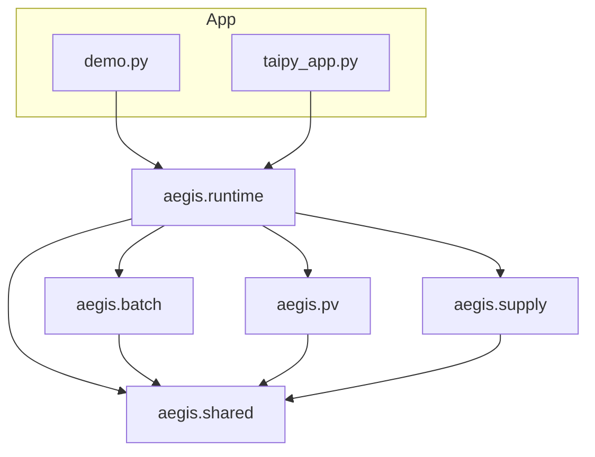

# Architecture — Modular Monolith Placement

**Question this file answers:** Where does the code belong?

| Field | Entry |
|---|---|
| Version / date | 1.0 / 2026-08-12 |
| Style | Modular monolith (single deployable) |
| ADR | ADR-013 |

## Context

AEGIS-PHARMA remains an advisory POC beside brownfield SoR systems. Modularization is an internal packaging decision — not a service split.

## Container / package view



## Why not microservices

- Offline synthetic assessed mode
- Three workflows already co-located and small
- Shared fail-closed gates must stay consistent in one process
- Ops burden of separate deploys unjustified for POC

## Relationship to agentic track

```
modular-specs (this)     →  creates shared/batch/pv/supply/runtime
submission/specs         →  later adds aegis.agents + envelope on top
```

Do not implement agents in this architecture pass.

## C4 note (for artefact update in M-008)

Add component: “Modular packages under `submission/src/aegis` with runtime composition root; workflows isolated; shared policy/contracts kernel.”
